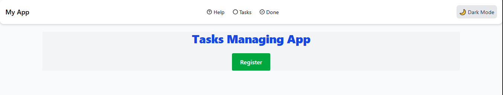
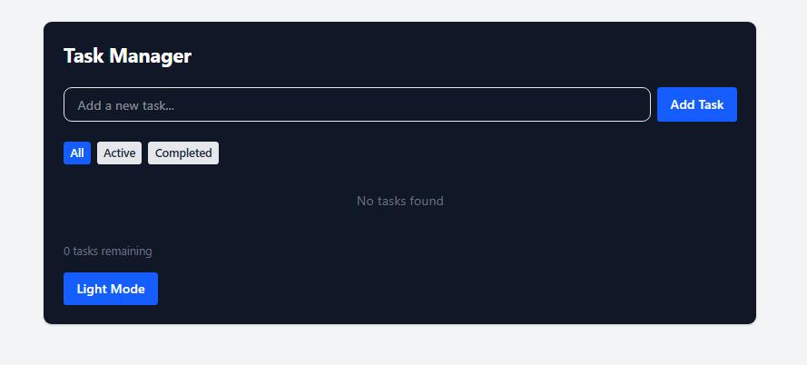
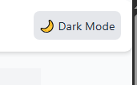

# Week 3 — React.js, JSX, and Tailwind CSS (My Assignment)

This repository holds my Week 3 front-end assignment where I built a responsive React application using JSX and Tailwind CSS. I used Vite as the development server and bundler.

## Assignment Overview

Overview of tasks I completed:
1. I set up a React project with Vite and Tailwind CSS
2. I created reusable UI components
3. I implemented state management using React hooks
4. I integrated external APIs for demo pages
5. I styled the application using Tailwind CSS

## Getting Started

How I prepared the project locally:

1. I accepted the GitHub Classroom assignment invitation (if applicable)
2. I cloned the repository to my machine
3. I installed dependencies by running:
   ```powershell
   npm install
   ```
4. I started the development server with:
   ```powershell
   npm run dev
   ```

## Files Included

- `Week3-Assignment.md`: Detailed assignment instructions
- Starter files included in the repository:
## Contents of this repo

- `Week3-Assignment.md` — assignment instructions and requirements that guided my work.
- `src/` — legacy or alternate starter sources at the repo root.
- `vite-project/` — the primary Vite React project where I implemented the assignment (this is the folder I run, build, and edit most often).

The active application and most work is inside `vite-project/` (see folder map below).

## Quick start (Windows PowerShell)

From the repository root I run the following in PowerShell:

```powershell
cd "vite-project"
npm install
npm run dev
```

I then open my browser to the local dev URL reported by Vite (usually http://localhost:5173).

Build for production:

```powershell
cd "vite-project"
npm run build
npm run preview   # preview the production build locally
```

Notes:
- The project's `package.json` and scripts live inside `vite-project/package.json`.
- I can use `yarn` or `pnpm` instead of `npm` if I prefer.

## Project structure (important folders)

Top-level layout:

```
vite-project/
├── index.html
├── package.json
├── vite.config.js
├── src/
│   ├── main.jsx
│   ├── App.jsx
│   ├── index.css
│   ├── assets/
│   ├── components/
│   │   ├── Button.jsx
│   │   ├── Card.jsx
│   │   ├── TaskManager.jsx
│   │   └── ... (ui primitives in ui/)
│   ├── hooks/
│   │   └── useLocalStorage.js
│   ├── lib/
│   │   └── utils.js
│   └── pages/
│       └── ApiData.jsx
└── public/
```

Root `src/` (older starter files) contains a minimal `App.jsx` and `components/` — treat `vite-project/src/` as the primary app.

## What I included and where

- UI components: `vite-project/src/components/` — reusable components and small UI primitives in `ui/`.
- Pages: `vite-project/src/pages/` — example pages I created (e.g., `ApiData.jsx`) demonstrating data fetching.
- Hooks: `vite-project/src/hooks/` — custom hooks I wrote (e.g., `useLocalStorage.js`).
- Utilities: `vite-project/src/lib/utils.js` — helper functions I use across components.

## Application Screenshots

### Home Page


### Task Manager


### Dark Mode



## Development notes

- Frameworks/libraries: React (JSX) + Vite. Tailwind CSS is included in the starter; check `vite-project` for Tailwind config if present.
- State: Hooks-based local state is used (no global state manager required).
- Assets: images and static assets belong in `vite-project/public/` or `vite-project/src/assets/`.
- Linting / formatting: look for an ESLint config (there is an `eslint.config.js` in the repo). I run any configured linters from the `vite-project` directory when I add lint scripts.

## Common tasks I perform

- Start dev server (development): `npm run dev` (from `vite-project`)
- Preview production build locally: `npm run preview`
- Add a component: I create a file under `vite-project/src/components/`, export it, and import it into `App.jsx` or a page to test.

## Troubleshooting

- Node version: I recommend a recent LTS (16+ or 18+). If install errors occur, I check `node -v` and update Node if needed.
- Port in use: Vite will prompt for a different port if 5173 is taken. I can also start with a specific port from PowerShell: `($env:PORT = 3000); npm run dev`.
- Missing dependencies: I run `npm install` inside `vite-project/`.

## How to contribute or extend

1. Fork or branch from `main`.
2. Add your feature or fix under `vite-project/src/`.
3. Run the app locally and add a simple test/demo to `App.jsx`.
4. Create a PR with a clear description of what changed and why.
